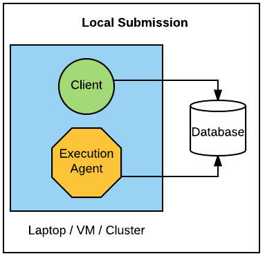
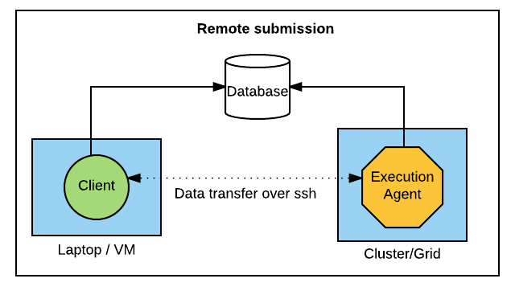

# Local and Remote submission modes using RADICAL Pilot, Ensemble Toolkit

This document describes two `submission modes` with RADICAL-Pilot and Ensemble Toolkit, namely, `Local` and `Remote` submission modes. 

There are 3 major components involved in the execution of any script:

* Client - the script that the user creates and executes.
* Execution Agent - a set of processes that run on the target machine which manage the execution of the actual science tools within tasks.
* Database - a MongoDB database, used to coordinate activities between the client and the execution agent.

There are few general requirements in this setup:

* The client application can run on a laptop, desktop, or server, etc.
* The database needs to be operated where both the client and the execution agent can reach it.
* Both the client and the database needs to be online during the entire duration of the exection.

## Local submission 

In this mode, both the client and the agent run on the same machine. The machine could be a laptop, or VM. There is an important distinction when the resource is a cluster.

In the case of local submission on a cluster, the client script usually sits on the head nodes (or login node) of the cluster. Depending on the specifications given by the user, the execution agent can also execute on the head nodes (generally not recommended - but ok for small tests) or the compute nodes of the cluster (for actual experiments). In either case, the client script runs on the head node. If the client script is load intensive or the load on the login nodes is high (due to multiple users etc), the node may be unavailable or slow, possibly resulting in execution delays or termination by admins.

Note: In a cluster, when the execution agent is also on the head node, then the scenario is essentially equivalent to a laptop or VM.

## Remote submission

Due to the above constraints on the cluster head nodes, a remote submission mechanism could be very useful. In this mode, the client script sits on a machine local to the user, and the execution agent runs on the compute nodes of the cluster. The head node is still used to log into the machine and to submit a resource reservation.

This mechanism requires a passwordless ssh (or gsissh) login to the particular cluster. [This](http://linuxproblem.org/art_9.html) document gives the basic steps in setting up passwordless ssh login to any machine.

Remote submission is also the natural choice when an experiment involves multiple compute resources.

## Some more details

* The location of the database does not effect the execution too significantly (apart from latency). The requirements are that the database be on a persistent machine + accessible by both client and agent. But, the client may not be executed on head nodes of clusters for the same reason as stated above.

* http://www.mlab.com/ is a recommendation and is also used by the RADICAL team.
